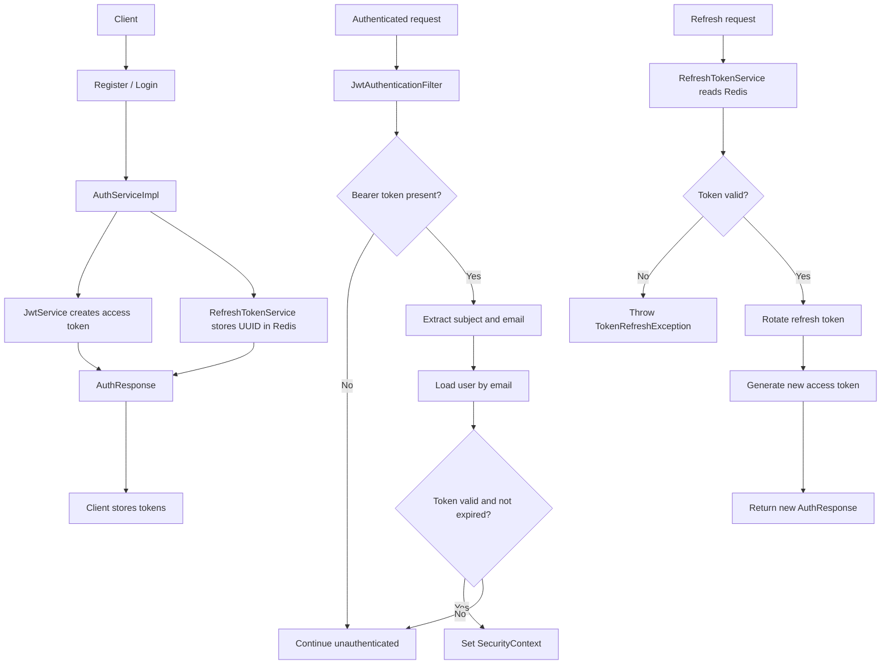

# Authentication Documentation

## Overview

Authentication is handled with a short-lived JWT access token and a long-lived refresh token stored in Redis. Public auth endpoints are allowed through Spring Security, while all other protected requests must present a valid `Authorization: Bearer <token>` header.

## Public Endpoints

The security configuration currently permits these routes without prior authentication:

- `POST /api/v1/auth/register`
- `POST /api/v1/auth/login`
- `POST /api/v1/auth/refresh`

Additional read-only public endpoints:

- `GET /api/v1/lawyers/**`
- `GET /api/v1/specialties/**`

Everything else requires authentication unless explicitly allowed elsewhere.

## Token Model

### Access Token

The access token is a signed JWT created by `JwtService`.

It contains:

- `sub`: the user id
- `email`: the user email
- `role`: the user role
- `iat`: issued-at timestamp
- `exp`: expiration timestamp

Important details:

- It is signed with the configured secret key.
- Its lifetime is controlled by `jwt.expiration`.
- It is validated on every request by `JwtAuthenticationFilter`.

### Refresh Token

The refresh token is a UUID, not a JWT.

Important details:

- It is stored in Redis under a `refresh:{token}` key.
- The Redis value is the user id.
- The key TTL is controlled by `jwt.refresh-expiration` with a default of `604800` seconds.
- It is rotated on refresh, which means the old token is deleted and replaced with a new one.

## Authentication Flow

### 1. Register

1. The client sends a `RegisterRequest` with first name, last name, email, password, age, and role.
2. The service checks whether the email already exists.
3. The password is encoded with BCrypt before saving.
4. A new active user is created.
5. The API returns an `AuthResponse` containing both tokens and basic identity data.

Nuance:

- Registration immediately authenticates the newly created user by issuing tokens.
- Duplicate emails are rejected with a conflict error.

### 2. Login

1. The client sends a `LoginRequest` with email and password.
2. `AuthenticationManager` validates the credentials using the configured `DaoAuthenticationProvider`.
3. If authentication fails, the service throws `InvalidCredentialsException`.
4. If authentication succeeds, the user is loaded from the database.
5. The API returns a fresh `AuthResponse` with new access and refresh tokens.

Nuance:

- The service intentionally does not reveal whether the account is disabled or the password was wrong.
- That keeps the login failure message generic and avoids leaking account state.

### 3. Request Authentication

1. For every request, `JwtAuthenticationFilter` checks the `Authorization` header.
2. If the header is missing or does not start with `Bearer `, the request continues unauthenticated.
3. If a token is present, the filter extracts the subject and email from the JWT.
4. The user is loaded by email from the `UserDetailsService`.
5. The token is accepted only if the subject matches the user id and the token is not expired.
6. The authenticated user is placed into the Spring Security context.

Nuance:

- Invalid JWTs do not crash the request pipeline; they are logged and the request continues unauthenticated.
- If the context is already authenticated, the filter does not overwrite it.

### 4. Refresh Token Rotation

1. The client sends a `RefreshTokenRequest` with the current refresh token.
2. The service looks up the user id from Redis.
3. If the token is missing or expired, a `TokenRefreshException` is thrown.
4. If the user no longer exists, a `TokenRefreshException` is thrown.
5. If the user exists but is disabled, the refresh token is deleted and a `TokenRefreshException` is thrown.
6. If the user is valid, the old refresh token is deleted and a new one is generated.
7. A new access token is also generated and returned.

Nuance:

- Refresh tokens are single-use after rotation.
- Disabled accounts cannot continue refreshing; their token is invalidated during the refresh attempt.

### 5. Logout

1. The client sends the refresh token to logout.
2. The token is deleted from Redis.

Nuance:

- Logout invalidates the refresh token, but already issued access tokens remain valid until they expire.

## Response Shape

Successful auth responses return `AuthResponse` with:

- `accessToken`
- `refreshToken`
- `tokenType` set to `Bearer`
- `expiresIn` in seconds for the access token
- `userId`
- `role`

## Security Nuances

- Passwords are stored encoded with BCrypt, never as plaintext.
- JWT authentication is stateless; the app does not keep server-side session state for access tokens.
- Refresh tokens are the only stateful part of the auth flow because they live in Redis.
- Access token validation currently relies on the user id and expiry. The email and role claims are included for downstream use, not as the primary validation source.
- `JwtAuthenticationFilter` only activates when a Bearer token is present, which keeps public routes lightweight.

## Configuration Notes

- `jwt.secret` is required for signing JWTs.
- `jwt.expiration` defines the access token lifetime.
- `jwt.refresh-expiration` defines the refresh token lifetime and defaults to 7 days if not provided.

## Mermaid Flow

